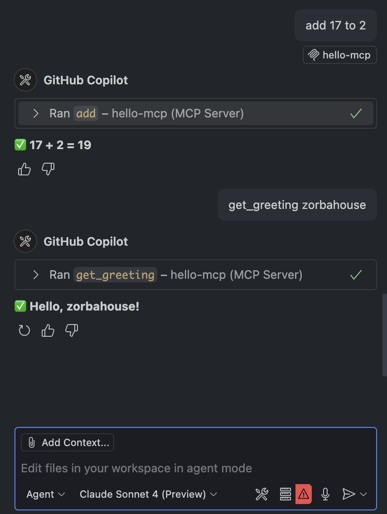
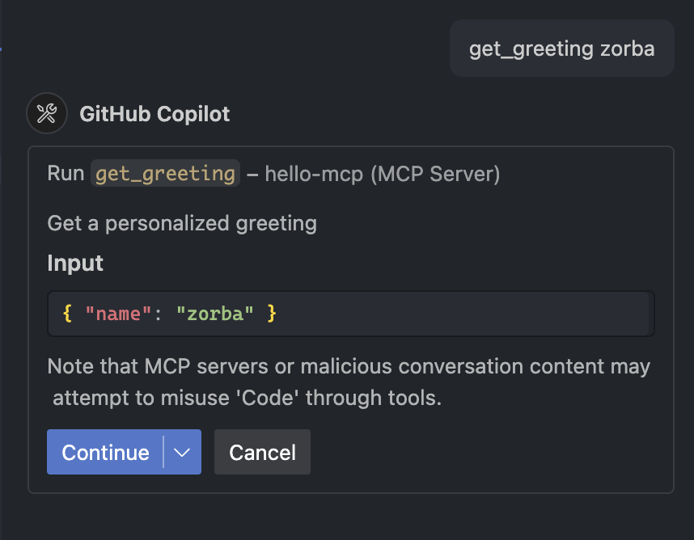
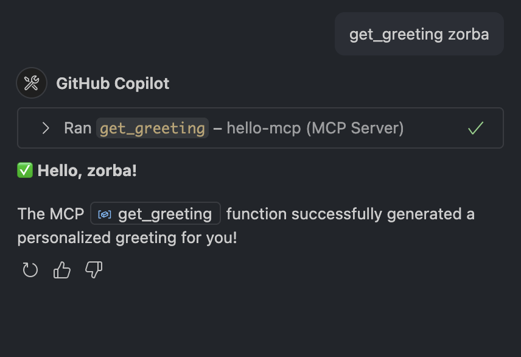
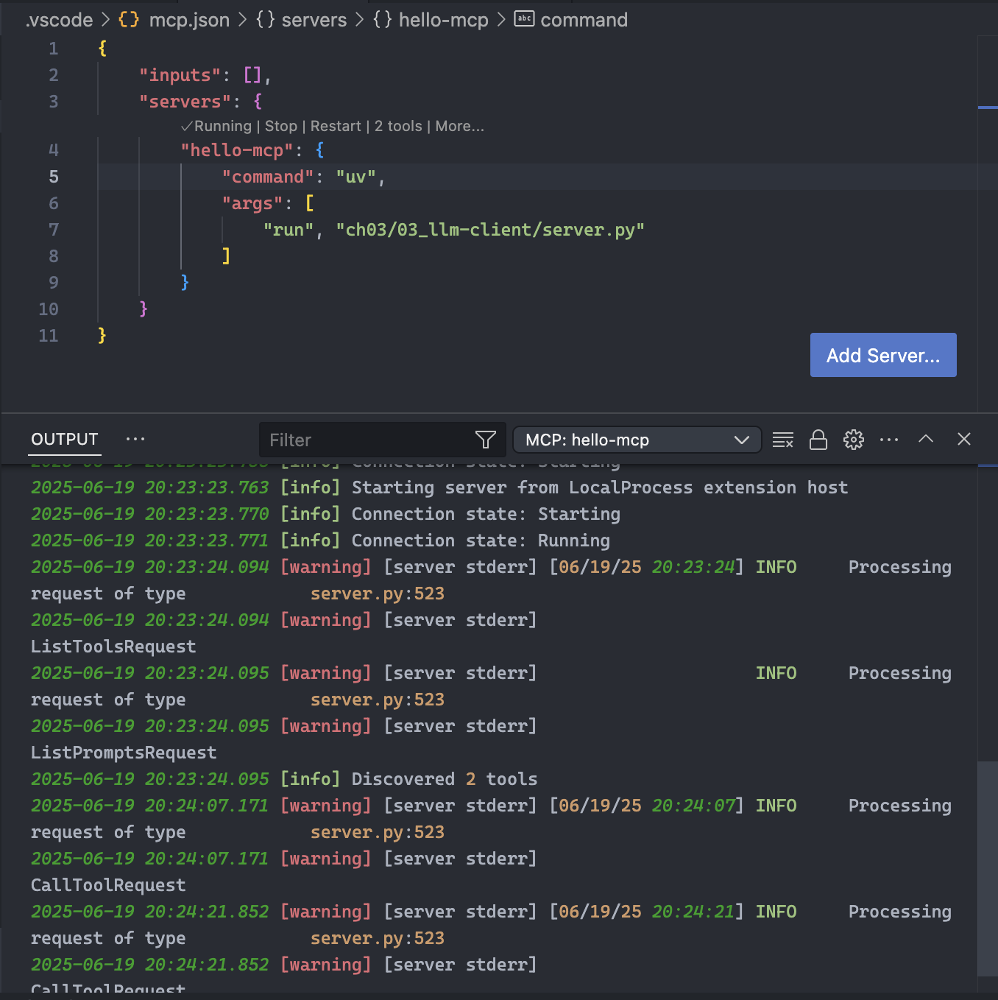

# 4단계: VS Code와 MCP 서버 연동하기

이 문서에서는 작성한 Python 기반 MCP 서버를 Visual Studio Code와 연동하는 방법을 안내합니다. 이를 통해 VS Code의 채팅창(@workspace)에서 직접 MCP 서버의 도구를 사용하거나 리소스에 접근할 수 있습니다.

## 1. MCP 서버를 VS Code에 등록하기

VS Code에 내장된 MCP 클라이언트에게 우리가 만든 서버의 위치와 실행 방법을 알려주어야 합니다. 터미널에서 다음 명령어를 실행하여 서버를 등록합니다.

### 명령어

```bash
code --add-mcp '{"name":"Python LLM Server","command":"uv","args":["run","python","ch03/03_llm-client/server.py"]}'
```

### 명령어 분석

이 명령어는 VS Code에 JSON 형식으로 서버 정보를 전달합니다.

-   `name`: `"Python LLM Server"`
    -   VS Code에 표시될 서버의 별명입니다. 원하는 이름으로 변경할 수 있습니다.
-   `command`: `"uv"`
    -   서버를 실행할 기본 명령어입니다. 우리는 `uv`를 사용합니다.
-   `args`: `["run", "python", "ch03/03_llm-client/server.py"]`
    -   `command`에 전달될 인자(arguments)입니다. 즉, `uv run python ch03/03_llm-client/server.py` 명령으로 서버를 실행하겠다는 의미입니다.

> **⚠️ 참고: 명령어 실행 시 오류가 발생할 경우**
>
> `code --add-mcp` 명령어는 일부 환경에서 `Abort trap: 6`과 같은 내부 오류를 발생시키며 비정상적으로 종료될 수 있습니다. 하지만 오류 메시지 위에 `Added MCP servers: Python LLM Server`와 같은 성공 메시지가 출력되었다면, 서버는 정상적으로 등록된 것이니 다음 단계로 진행해도 됩니다.

## 2. 등록된 서버 확인 및 수정

등록된 정보는 VS Code의 사용자 설정 파일(`settings.json`)에 저장됩니다.

### 확인 및 수정 방법

1.  **VS Code 설정 열기**:
    -   macOS: `Cmd + ,` (쉼표)
    -   명령 팔레트 (`Cmd + Shift + P`)에서 `Preferences: Open User Settings (JSON)` 검색
2.  **`settings.json` 파일 확인**:
    -   파일 안에 다음과 같이 `mcp.servers` 항목이 추가된 것을 볼 수 있습니다.

    ```json
    "mcp.servers": [
        {
            "name": "Python LLM Server",
            "command": "uv",
            "args": [
                "run",
                "python",
                "ch03/03_llm-client/server.py"
            ]
        }
    ],
    ```

이곳에서 직접 서버 정보를 수정하거나 항목을 삭제하여 등록을 해제할 수 있습니다.

## 3. VS Code에서 MCP 서버에 연결하기

이제 VS Code의 기능을 통해 서버를 실행하고 연결할 수 있습니다.

1.  **명령 팔레트 열기**: `Cmd + Shift + P`
2.  **`MCP: Connect To Server`** 명령을 검색하고 실행합니다.
3.  목록에 방금 등록한 **`Python LLM Server`**가 나타납니다. 이것을 선택합니다.
4.  VS Code가 자동으로 `uv run python ...` 명령을 실행하여 백그라운드에서 서버를 시작하고 연결합니다.
5.  VS Code 하단의 상태 표시줄에 "MCP: Python LLM Server"가 표시되며 연결이 성공했음을 알려줍니다.

## 4. 채팅창에서 도구 사용하기

연결이 성공하면, 이제 VS Code의 채팅창에서 `@workspace` 에이전트를 통해 서버의 기능을 사용할 수 있습니다.

1.  채팅창을 엽니다.
2.  `@workspace`를 입력하여 에이전트를 호출합니다.
3.  서버에 등록된 도구를 사용하도록 요청합니다.

    > `@workspace /tools`
    > *→ 사용 가능한 도구 목록(`add`, `get_greeting`)을 보여줍니다.*

    > `@workspace please add 123 to 456`
    > *→ `add` 도구를 호출하여 `579`라는 결과를 보여줍니다.*

    > `@workspace give me a greeting for "VS Code"`
    > *→ `get_greeting` 도구를 호출하여 `"Hello, VS Code!"`라는 결과를 보여줍니다.*

이제 VS Code의 강력한 AI 기능과 직접 만든 Python MCP 서버가 완벽하게 연동되었습니다! 

---
## vscode chat tab에서 실행
---

### 1. add() tool call 


---

### 2. get_greeting() tool call



---

### 3. log message
