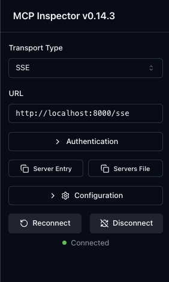

# 5단계: SSE 서버 생성하기

이전 단계에서는 `stdio`를 통해 MCP 서버와 통신했습니다. 이 방법은 간단하지만, 하나의 클라이언트만 연결할 수 있다는 한계가 있습니다. 이번 단계에서는 **SSE(Server-Sent Events)**를 사용하여 여러 클라이언트가 동시에 접속하고 실시간 업데이트를 받을 수 있는 웹 기반 MCP 서버를 구축합니다.

## 학습 목표

-   SSE 프로토콜의 개념을 이해합니다.
-   Python의 ASGI 프레임워크인 `Starlette`와 웹 서버인 `uvicorn`을 사용합니다.
-   웹 기반 MCP 서버를 실행하고 Inspector로 테스트합니다.
-   서버 라우팅(Routing)과 마운트(Mount)의 개념을 이해합니다.

## 1. 서버 코드 이해하기 (`server.py`)

`ch03/05_sse-server/server.py` 파일의 코드는 다음과 같은 주요 부분으로 구성됩니다.

### 가. 기본 라이브러리 임포트

```python
from starlette.applications import Starlette
from starlette.routing import Mount
from mcp.server.fastmcp import FastMCP
```

-   `Starlette`: 경량 ASGI(Asynchronous Server Gateway Interface) 웹 프레임워크입니다. 우리 서버의 기본 뼈대 역할을 합니다.
-   `Mount`: 다른 ASGI 애플리케이션을 특정 경로에 "장착"하여 하위 애플리케이션으로 포함시키는 기능입니다.
-   `FastMCP`: 우리가 사용할 MCP 서버 구현체입니다.

### 나. MCP 서버 인스턴스 생성

```python
mcp = FastMCP(name="CH03/05 SSE Server", version="1.0.0")
```

-   `stdio` 방식과 동일하게, `FastMCP` 객체를 생성합니다.

### 다. Starlette 앱과 라우팅 설정

```python
app = Starlette(
    routes=[
        # 루트(/) 경로와 /sse 경로 모두에 동일한 MCP 앱을 마운트하여
        # 다양한 클라이언트와의 호환성을 보장합니다.
        Mount("/", app=mcp.sse_app()),
        Mount("/sse", app=mcp.sse_app()),
    ]
)
```

-   **가장 중요한 부분입니다.** `Starlette`를 사용하여 메인 웹 애플리케이션(`app`)을 생성합니다.
-   `mcp.sse_app()`: 이 메서드는 **SSE 통신 기능이 내장된, 이미 완성된 작은 ASGI 앱**을 반환합니다. 이 작은 앱 내부에는 `/sse`, `/messages`와 같은 통신에 필요한 경로들이 미리 정의되어 있습니다.
-   `Mount("/", ...)`: `npx`와 같이 단순한 클라이언트가 `http://localhost:8000/sse`로 직접 접속할 수 있도록 루트 경로에 MCP 앱을 마운트합니다.
-   `Mount("/sse", ...)`: Inspector와 같이 좀 더 복잡한 핸드셰이크 과정을 거치는 클라이언트가 `http://localhost:8000/sse`라는 명시적인 엔드포인트를 쉽게 찾을 수 있도록 별도로 마운트합니다.
-   **결론**: 이 설정은 "자동차의 어떤 문으로 타든 결국 운전석으로 갈 수 있게" 하는 것과 같이, 다양한 클라이언트의 접속 방식을 모두 지원하여 호환성을 극대화하는 영리한 방법입니다.

### 라. 서버 실행 코드

```python
if __name__ == "__main__":
    import uvicorn
    uvicorn.run(app, host="0.0.0.0", port=8000)
```

-   이 파이썬 파일이 직접 실행될 때(`uv run python server.py`), `uvicorn`이라는 ASGI 서버를 사용하여 `app`을 `8000`번 포트에서 실행하라는 의미입니다.

## 2. SSE 서버 실행 및 테스트

웹 기반 서버는 클라이언트와 독립적으로 항상 실행되어 있어야 합니다. 따라서 두 개의 터미널을 사용해야 합니다.

### 가. [터미널 1] 서버 실행하기

먼저, `uvicorn`을 사용하여 실제 SSE 서버를 시작합니다.

```bash
# ch03/05_sse-server 디렉토리로 이동
cd ch03/05_sse-server

# uvicorn으로 서버 실행
uv run python server.py
```

-   `INFO: Application startup complete.` 메시지가 나타나며 서버가 `http://0.0.0.0:8000`에서 실행됩니다.
-   **이 터미널은 그대로 둔 채로 둡니다.**

### 나. [터미널 2] `npx`로 직접 테스트하기 (선택 사항)

별도의 새 터미널을 열고, `npx` CLI 도구를 사용하여 서버가 정상적으로 응답하는지 직접 확인할 수 있습니다.

```bash
npx @modelcontextprotocol/inspector --cli http://localhost:8000/sse --method tools/list
```

-   이 명령은 실행 중인 서버의 `/sse` 경로에 접속하여 `tools/list` 메서드를 호출합니다.
-   서버에 정의된 `add` 도구의 정보가 JSON 형태로 출력되면 성공입니다.

### 다. Inspector로 연결하여 테스트하기

1.  **Inspector 실행**: `mcp dev`는 Inspector를 실행하기 위한 편리한 도구입니다. **별도의 새 터미널**에서 다음을 실행합니다.
    ```bash
    # ch03/05_sse-server 디렉토리에서 실행
    uv run mcp dev server.py --with uvicorn
    ```
2.  **브라우저에서 Inspector 열기**: 터미널에 표시된 `http://localhost:6274` 주소를 엽니다.

3.  **서버에 연결**:
    -   **Connect** 섹션으로 이동합니다.
    -   **Transport**: `Server-Sent Events (SSE)`를 선택합니다.
    -   **Endpoint URL**: `http://localhost:8000/sse`를 입력합니다.
    -   **"Connect"** 버튼을 클릭합니다.

 

4.  **도구 테스트**: 연결이 성공하면, **Tools** 탭으로 이동하여 `add` 함수를 찾아 파라미터를 입력하고 실행해 보세요.

---

이제 여러 클라이언트가 동시에 접속할 수 있는 강력한 웹 기반 MCP 서버를 구축하고 테스트하는 데 성공했습니다! 