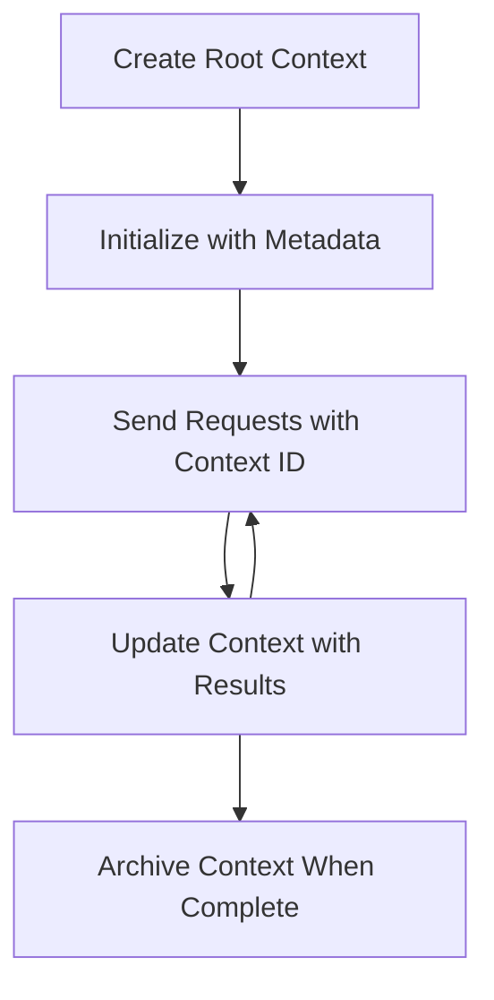

# MCP Root Contexts

Root contexts are a fundamental concept in the Model Context Protocol that provide a persistent layer for maintaining conversation history and shared state across multiple requests and sessions.

## Introduction

In this lesson, we will explore how to create, manage, and utilize root contexts in MCP. 

## Learning Objectives

By the end of this lesson, you will be able to:

- Understand the purpose and structure of root contexts
- Create and manage root contexts using MCP client libraries
- Implement root contexts in .NET, Java, JavaScript, and Python applications
- Utilize root contexts for multi-turn conversations and state management
- Implement best practices for root context management

## Understanding Root Contexts

Root contexts serve as containers that hold the history and state for a series of related interactions. They enable:

- **Conversation Persistence**: Maintaining coherent multi-turn conversations
- **Memory Management**: Storing and retrieving information across interactions
- **State Management**: Tracking progress in complex workflows
- **Context Sharing**: Allowing multiple clients to access the same conversation state

In MCP, root contexts have these key characteristics:

- Each root context has a unique identifier.
- They can contain conversation history, user preferences, and other metadata.
- They can be created, accessed, and archived as needed.
- They support fine-grained access control and permissions.

## Root Context Lifecycle



## Working with Root Contexts

Here's an example of how to create and manage root contexts. 

<details>
<summary>csharp</summary>

```csharp
// .NET Example: Root Context Management
using Microsoft.Mcp.Client;
using System;
using System.Threading.Tasks;
using System.Collections.Generic;

public class RootContextExample
{
    private readonly IMcpClient _client;
    private readonly IRootContextManager _contextManager;
    
    public RootContextExample(IMcpClient client, IRootContextManager contextManager)
    {
        _client = client;
        _contextManager = contextManager;
    }
    
    public async Task DemonstrateRootContextAsync()
    {
        // 1. Create a new root context
        var contextResult = await _contextManager.CreateRootContextAsync(new RootContextCreateOptions
        {
            Name = "Customer Support Session",
            Metadata = new Dictionary<string, string>
            {
                ["CustomerName"] = "Acme Corporation",
                ["PriorityLevel"] = "High",
                ["Domain"] = "Cloud Services"
            }
        });
        
        string contextId = contextResult.ContextId;
        Console.WriteLine($"Created root context with ID: {contextId}");
        
        // 2. First interaction using the context
        var response1 = await _client.SendPromptAsync(
            "I'm having issues scaling my web service deployment in the cloud.", 
            new SendPromptOptions { RootContextId = contextId }
        );
        
        Console.WriteLine($"First response: {response1.GeneratedText}");
        
        // Second interaction - the model will have access to the previous conversation
        var response2 = await _client.SendPromptAsync(
            "Yes, we're using containerized deployments with Kubernetes.", 
            new SendPromptOptions { RootContextId = contextId }
        );
        
        Console.WriteLine($"Second response: {response2.GeneratedText}");
        
        // 3. Add metadata to the context based on conversation
        await _contextManager.UpdateContextMetadataAsync(contextId, new Dictionary<string, string>
        {
            ["TechnicalEnvironment"] = "Kubernetes",
            ["IssueType"] = "Scaling"
        });
        
        // 4. Get context information
        var contextInfo = await _contextManager.GetRootContextInfoAsync(contextId);
        
        Console.WriteLine("Context Information:");
        Console.WriteLine($"- Name: {contextInfo.Name}");
        Console.WriteLine($"- Created: {contextInfo.CreatedAt}");
        Console.WriteLine($"- Messages: {contextInfo.MessageCount}");
        
        // 5. When the conversation is complete, archive the context
        await _contextManager.ArchiveRootContextAsync(contextId);
        Console.WriteLine($"Archived context {contextId}");
    }
}
```

In the preceding code we've:

1. Created a root context for a customer support session.
1. Sent multiple messages within that context, allowing the model to maintain state.
1. Updated the context with relevant metadata based on the conversation.
1. Retrieved context information to understand the conversation history.
1. Archived the context when the conversation was complete.

</details>

## Example: Root Context Implementation for financial analysis

In this example, we will create a root context for a financial analysis session, demonstrating how to maintain state across multiple interactions.

<details>
<summary>java</summary>

```java
// Java Example: Root Context Implementation
package com.example.mcp.contexts;

import com.mcp.client.McpClient;
import com.mcp.client.ContextManager;
import com.mcp.models.RootContext;
import com.mcp.models.McpResponse;

import java.util.HashMap;
import java.util.Map;
import java.util.UUID;

public class RootContextsDemo {
    private final McpClient client;
    private final ContextManager contextManager;
    
    public RootContextsDemo(String serverUrl) {
        this.client = new McpClient.Builder()
            .setServerUrl(serverUrl)
            .build();
            
        this.contextManager = new ContextManager(client);
    }
    
    public void demonstrateRootContext() throws Exception {
        // Create context metadata
        Map<String, String> metadata = new HashMap<>();
        metadata.put("projectName", "Financial Analysis");
        metadata.put("userRole", "Financial Analyst");
        metadata.put("dataSource", "Q1 2025 Financial Reports");
        
        // 1. Create a new root context
        RootContext context = contextManager.createRootContext("Financial Analysis Session", metadata);
        String contextId = context.getId();
        
        System.out.println("Created context: " + contextId);
        
        // 2. First interaction
        McpResponse response1 = client.sendPrompt(
            "Analyze the trends in Q1 financial data for our technology division",
            contextId
        );
        
        System.out.println("First response: " + response1.getGeneratedText());
        
        // 3. Update context with important information gained from response
        contextManager.addContextMetadata(contextId, 
            Map.of("identifiedTrend", "Increasing cloud infrastructure costs"));
        
        // Second interaction - using the same context
        McpResponse response2 = client.sendPrompt(
            "What's driving the increase in cloud infrastructure costs?",
            contextId
        );
        
        System.out.println("Second response: " + response2.getGeneratedText());
        
        // 4. Generate a summary of the analysis session
        McpResponse summaryResponse = client.sendPrompt(
            "Summarize our analysis of the technology division financials in 3-5 key points",
            contextId
        );
        
        // Store the summary in context metadata
        contextManager.addContextMetadata(contextId, 
            Map.of("analysisSummary", summaryResponse.getGeneratedText()));
            
        // Get updated context information
        RootContext updatedContext = contextManager.getRootContext(contextId);
        
        System.out.println("Context Information:");
        System.out.println("- Created: " + updatedContext.getCreatedAt());
        System.out.println("- Last Updated: " + updatedContext.getLastUpdatedAt());
        System.out.println("- Analysis Summary: " + 
            updatedContext.getMetadata().get("analysisSummary"));
            
        // 5. Archive context when done
        contextManager.archiveContext(contextId);
        System.out.println("Context archived");
    }
}
```

In the preceding code, we've:

1. Created a root context for a financial analysis session.
2. Sent multiple messages within that context, allowing the model to maintain state.
3. Updated the context with relevant metadata based on the conversation.
4. Generated a summary of the analysis session and stored it in the context metadata.
5. Archived the context when the conversation was complete.

</details>

## Example: Root Context Management

Managing root contexts effectively is crucial for maintaining conversation history and state. Below is an example of how to implement root context management.

<details>
<summary>JavaScript</summary>

```javascript
// JavaScript Example: Managing MCP Root Contexts
const { McpClient, RootContextManager } = require('@mcp/client');

class ContextSession {
  constructor(serverUrl, apiKey = null) {
    // Initialize the MCP client
    this.client = new McpClient({
      serverUrl,
      apiKey
    });
    
    // Initialize context manager
    this.contextManager = new RootContextManager(this.client);
  }
  
  /**
   * Create a new conversation context
   * @param {string} sessionName - Name of the conversation session
   * @param {Object} metadata - Additional metadata for the context
   * @returns {Promise<string>} - Context ID
   */
  async createConversationContext(sessionName, metadata = {}) {
    try {
      const contextResult = await this.contextManager.createRootContext({
        name: sessionName,
        metadata: {
          ...metadata,
          createdAt: new Date().toISOString(),
          status: 'active'
        }
      });
      
      console.log(`Created root context '${sessionName}' with ID: ${contextResult.id}`);
      return contextResult.id;
    } catch (error) {
      console.error('Error creating root context:', error);
      throw error;
    }
  }
  
  /**
   * Send a message in an existing context
   * @param {string} contextId - The root context ID
   * @param {string} message - The user's message
   * @param {Object} options - Additional options
   * @returns {Promise<Object>} - Response data
   */
  async sendMessage(contextId, message, options = {}) {
    try {
      // Send the message using the specified context
      const response = await this.client.sendPrompt(message, {
        rootContextId: contextId,
        temperature: options.temperature || 0.7,
        allowedTools: options.allowedTools || []
      });
      
      // Optionally store important insights from the conversation
      if (options.storeInsights) {
        await this.storeConversationInsights(contextId, message, response.generatedText);
      }
      
      return {
        message: response.generatedText,
        toolCalls: response.toolCalls || [],
        contextId
      };
    } catch (error) {
      console.error(`Error sending message in context ${contextId}:`, error);
      throw error;
    }
  }
  
  /**
   * Store important insights from a conversation
   * @param {string} contextId - The root context ID
   * @param {string} userMessage - User's message
   * @param {string} aiResponse - AI's response
   */
  async storeConversationInsights(contextId, userMessage, aiResponse) {
    try {
      // Extract potential insights (in a real app, this would be more sophisticated)
      const combinedText = userMessage + "\n" + aiResponse;
      
      // Simple heuristic to identify potential insights
      const insightWords = ["important", "key point", "remember", "significant", "crucial"];
      
      const potentialInsights = combinedText
        .split(".")
        .filter(sentence => 
          insightWords.some(word => sentence.toLowerCase().includes(word))
        )
        .map(sentence => sentence.trim())
        .filter(sentence => sentence.length > 10);
      
      // Store insights in context metadata
      if (potentialInsights.length > 0) {
        const insights = {};
        potentialInsights.forEach((insight, index) => {
          insights[`insight_${Date.now()}_${index}`] = insight;
        });
        
        await this.contextManager.updateContextMetadata(contextId, insights);
        console.log(`Stored ${potentialInsights.length} insights in context ${contextId}`);
      }
    } catch (error) {
      console.warn('Error storing conversation insights:', error);
      // Non-critical error, so just log warning
    }
  }
  
  /**
   * Get summary information about a context
   * @param {string} contextId - The root context ID
   * @returns {Promise<Object>} - Context information
   */
  async getContextInfo(contextId) {
    try {
      const contextInfo = await this.contextManager.getContextInfo(contextId);
      
      return {
        id: contextInfo.id,
        name: contextInfo.name,
        created: new Date(contextInfo.createdAt).toLocaleString(),
        lastUpdated: new Date(contextInfo.lastUpdatedAt).toLocaleString(),
        messageCount: contextInfo.messageCount,
        metadata: contextInfo.metadata,
        status: contextInfo.status
      };
    } catch (error) {
      console.error(`Error getting context info for ${contextId}:`, error);
      throw error;
    }
  }
  
  /**
   * Generate a summary of the conversation in a context
   * @param {string} contextId - The root context ID
   * @returns {Promise<string>} - Generated summary
   */
  async generateContextSummary(contextId) {
    try {
      // Ask the model to generate a summary of the conversation so far
      const response = await this.client.sendPrompt(
        "Please summarize our conversation so far in 3-4 sentences, highlighting the main points discussed.",
        { rootContextId: contextId, temperature: 0.3 }
      );
      
      // Store the summary in context metadata
      await this.contextManager.updateContextMetadata(contextId, {
        conversationSummary: response.generatedText,
        summarizedAt: new Date().toISOString()
      });
      
      return response.generatedText;
    } catch (error) {
      console.error(`Error generating context summary for ${contextId}:`, error);
      throw error;
    }
  }
  
  /**
   * Archive a context when it's no longer needed
   * @param {string} contextId - The root context ID
   * @returns {Promise<Object>} - Result of the archive operation
   */
  async archiveContext(contextId) {
    try {
      // Generate a final summary before archiving
      const summary = await this.generateContextSummary(contextId);
      
      // Archive the context
      await this.contextManager.archiveContext(contextId);
      
      return {
        status: "archived",
        contextId,
        summary
      };
    } catch (error) {
      console.error(`Error archiving context ${contextId}:`, error);
      throw error;
    }
  }
}

// Example usage
async function demonstrateContextSession() {
  const session = new ContextSession('https://mcp-server-example.com');
  
  try {
    // 1. Create a new context for a product support conversation
    const contextId = await session.createConversationContext(
      'Product Support - Database Performance',
      {
        customer: 'Globex Corporation',
        product: 'Enterprise Database',
        severity: 'Medium',
        supportAgent: 'AI Assistant'
      }
    );
    
    // 2. First message in the conversation
    const response1 = await session.sendMessage(
      contextId,
      "I'm experiencing slow query performance on our database cluster after the latest update.",
      { storeInsights: true }
    );
    console.log('Response 1:', response1.message);
    
    // Follow-up message in the same context
    const response2 = await session.sendMessage(
      contextId,
      "Yes, we've already checked the indexes and they seem to be properly configured.",
      { storeInsights: true }
    );
    console.log('Response 2:', response2.message);
    
    // 3. Get information about the context
    const contextInfo = await session.getContextInfo(contextId);
    console.log('Context Information:', contextInfo);
    
    // 4. Generate and display conversation summary
    const summary = await session.generateContextSummary(contextId);
    console.log('Conversation Summary:', summary);
    
    // 5. Archive the context when done
    const archiveResult = await session.archiveContext(contextId);
    console.log('Archive Result:', archiveResult);
    
    // 6. Handle any errors gracefully
  } catch (error) {
    console.error('Error in context session demonstration:', error);
  }
}

demonstrateContextSession();
```

In the preceding code we've:

1. Created a root context for a product support conversation with the function `createConversationContext`. In this case, the context is about database performance issues.

1. Sent multiple messages within that context, allowing the model to maintain state with the function `sendMessage`. The messages being sent are about slow query performance and index configuration.

1. Updated the context with relevant metadata based on the conversation.

1. Generated a summary of the conversation and stored it in the context metadata with the function `generateContextSummary`.

1. Archived the context when the conversation was complete with the function `archiveContext`.

1. Handled errors gracefully to ensure robustness.

</details>

## Root Context for Multi-Turn Assistance

In this example, we will create a root context for a multi-turn assistance session, demonstrating how to maintain state across multiple interactions.

<details>
<summary>Python</summary>

```python
# Python Example: Root Context for Multi-Turn Assistance
import asyncio
from datetime import datetime
from mcp_client import McpClient, RootContextManager

class AssistantSession:
    def __init__(self, server_url, api_key=None):
        self.client = McpClient(server_url=server_url, api_key=api_key)
        self.context_manager = RootContextManager(self.client)
    
    async def create_session(self, name, user_info=None):
        """Create a new root context for an assistant session"""
        metadata = {
            "session_type": "assistant",
            "created_at": datetime.now().isoformat(),
        }
        
        # Add user information if provided
        if user_info:
            metadata.update({f"user_{k}": v for k, v in user_info.items()})
            
        # Create the root context
        context = await self.context_manager.create_root_context(name, metadata)
        return context.id
    
    async def send_message(self, context_id, message, tools=None):
        """Send a message within a root context"""
        # Create options with context ID
        options = {
            "root_context_id": context_id
        }
        
        # Add tools if specified
        if tools:
            options["allowed_tools"] = tools
        
        # Send the prompt within the context
        response = await self.client.send_prompt(message, options)
        
        # Update context metadata with conversation progress
        await self.context_manager.update_context_metadata(
            context_id,
            {
                f"message_{datetime.now().timestamp()}": message[:50] + "...",
                "last_interaction": datetime.now().isoformat()
            }
        )
        
        return response
    
    async def get_conversation_history(self, context_id):
        """Retrieve conversation history from a context"""
        context_info = await self.context_manager.get_context_info(context_id)
        messages = await self.client.get_context_messages(context_id)
        
        return {
            "context_info": context_info,
            "messages": messages
        }
    
    async def end_session(self, context_id):
        """End an assistant session by archiving the context"""
        # Generate a summary prompt first
        summary_response = await self.client.send_prompt(
            "Please summarize our conversation and any key points or decisions made.",
            {"root_context_id": context_id}
        )
        
        # Store summary in metadata
        await self.context_manager.update_context_metadata(
            context_id,
            {
                "summary": summary_response.generated_text,
                "ended_at": datetime.now().isoformat(),
                "status": "completed"
            }
        )
        
        # Archive the context
        await self.context_manager.archive_context(context_id)
        
        return {
            "status": "completed",
            "summary": summary_response.generated_text
        }

# Example usage
async def demo_assistant_session():
    assistant = AssistantSession("https://mcp-server-example.com")
    
    # 1. Create session
    context_id = await assistant.create_session(
        "Technical Support Session",
        {"name": "Alex", "technical_level": "advanced", "product": "Cloud Services"}
    )
    print(f"Created session with context ID: {context_id}")
    
    # 2. First interaction
    response1 = await assistant.send_message(
        context_id, 
        "I'm having trouble with the auto-scaling feature in your cloud platform.",
        ["documentation_search", "diagnostic_tool"]
    )
    print(f"Response 1: {response1.generated_text}")
    
    # Second interaction in the same context
    response2 = await assistant.send_message(
        context_id,
        "Yes, I've already checked the configuration settings you mentioned, but it's still not working."
    )
    print(f"Response 2: {response2.generated_text}")
    
    # 3. Get history
    history = await assistant.get_conversation_history(context_id)
    print(f"Session has {len(history['messages'])} messages")
    
    # 4. End session
    end_result = await assistant.end_session(context_id)
    print(f"Session ended with summary: {end_result['summary']}")

if __name__ == "__main__":
    asyncio.run(demo_assistant_session())
```

In the preceding code we've:

1. Created a root context for a technical support session with the function `create_session`. The context includes user information such as name and technical level.

1. Sent multiple messages within that context, allowing the model to maintain state with the function `send_message`. The messages being sent are about issues with the auto-scaling feature.

1. Retrieved conversation history using the function `get_conversation_history`, which provides context information and messages.

1. Ended the session by archiving the context and generating a summary with the function `end_session`. The summary captures key points from the conversation.

</details>

## Root Context Best Practices

Here are some best practices for managing root contexts effectively:

- **Create Focused Contexts**: Create separate root contexts for different conversation purposes or domains to maintain clarity.

- **Set Expiration Policies**: Implement policies to archive or delete old contexts to manage storage and comply with data retention policies.

- **Store Relevant Metadata**: Use context metadata to store important information about the conversation that might be useful later.

- **Use Context IDs Consistently**: Once a context is created, use its ID consistently for all related requests to maintain continuity.

- **Generate Summaries**: When a context grows large, consider generating summaries to capture essential information while managing context size.

- **Implement Access Control**: For multi-user systems, implement proper access controls to ensure privacy and security of conversation contexts.

- **Handle Context Limitations**: Be aware of context size limitations and implement strategies for handling very long conversations.

- **Archive When Complete**: Archive contexts when conversations are complete to free resources while preserving the conversation history.

## What's next

- [5.5 Routing](../mcp-routing/README.md)

# Root Context를 활용한 세션 관리 예제

이 예제는 MCP(Model Context Protocol)의 Root Context 개념을 활용하여 세션 기반 대화 관리 시스템을 구현합니다.

## 주요 기능

### 서버 (server.py)
- **세션 관리**: 여러 개의 독립적인 대화 세션 생성 및 관리
- **대화 기록**: 각 세션별로 대화 내용 저장
- **세션 검색**: 키워드로 세션 내용 검색
- **세션 요약**: 세션 종료 시 자동 요약 생성

### 클라이언트 (client.py)
- **자동 데모**: 기술 지원 시나리오 자동 실행
- **대화형 데모**: 사용자가 직접 세션을 관리하는 인터랙티브 모드

## 실행 방법

실행 방법에 대한 자세한 내용은 [how-to-run.md](./how-to-run.md) 파일을 참조하세요.

### 빠른 시작
```bash
# 간단한 통합 데모 실행
uv run python ch05-advanced-topicss/04_mcp-root-contexts/simple_demo.py
```

## 사용 가능한 도구

### 세션 관리
- `create_session`: 새 세션 생성
- `end_session`: 세션 종료 및 요약
- `list_sessions`: 세션 목록 조회

### 대화 관리
- `send_message`: 세션에 메시지 전송
- `get_conversation_history`: 대화 기록 조회
- `search_sessions`: 세션 내용 검색

## 리소스

- `session://{session_id}`: 특정 세션의 전체 정보
- `sessions/active`: 현재 활성 세션 목록


### Root Context의 활용

이 예제에서 Root Context는 다음과 같이 활용됩니다:

1. **세션 격리**: 각 세션은 독립적인 컨텍스트를 가짐
2. **상태 유지**: 세션별로 대화 기록과 메타데이터 유지
3. **컨텍스트 전환**: 여러 세션 간 자유로운 전환
4. **기록 보존**: 세션 종료 후에도 대화 내용 보존

## 파일 구조

- `simple_demo.py`: 서버와 클라이언트가 통합된 간단한 데모 (입문자용)
- `server.py`: MCP 서버 구현 (FastMCP 사용)
- `client.py`: MCP 클라이언트 구현 (stdio transport 사용)
- `README.md`: 이 문서

## 확장 가능성

- 실제 LLM 연동으로 지능적인 응답 생성
- 데이터베이스 연동으로 영구 저장
- 사용자 인증 및 권한 관리
- 세션별 커스텀 도구 활성화
- 대화 분석 및 인사이트 제공

