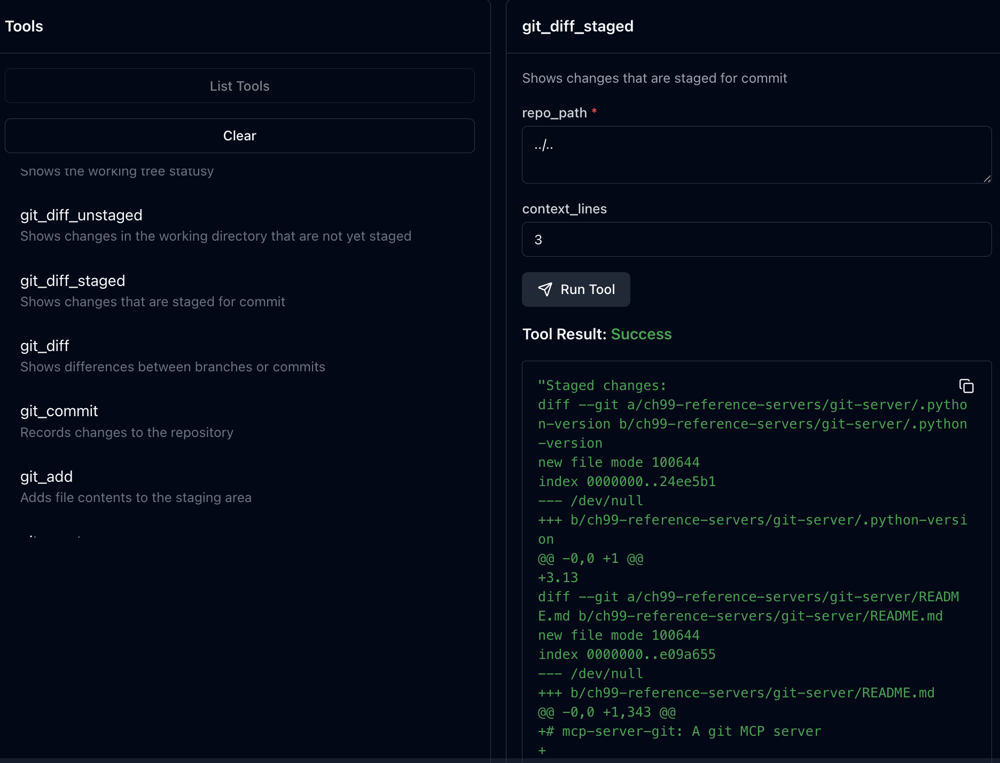

# Git Server 실행 및 테스트 가이드

Git MCP Server를 실행하고 테스트하는 다양한 방법을 설명합니다.

## 📋 목차

1. [기본 실행 방법](#기본-실행-방법)
2. [MCP Inspector로 테스트](#mcp-inspector로-테스트)
3. [자동화된 테스트 클라이언트](#자동화된-테스트-클라이언트)
4. [웹 브라우저 테스터](#웹-브라우저-테스터)
5. [주요 수정사항](#주요-수정사항)
6. [문제 해결](#문제-해결)

---

## 🚀 기본 실행 방법

### 1. 직접 실행

```bash
# git-server 디렉토리로 이동
cd ch99-reference-servers/git-server

# Git server 실행 (현재 디렉토리를 repository로 설정)
uv run python -m mcp_server_git --repository .

# 다른 Git repository를 지정하려면
uv run python -m mcp_server_git --repository /path/to/your/git/repo

# 상위 디렉토리를 repository로 설정 (이 프로젝트의 경우)
uv run python -m mcp_server_git --repository ../..
```

### 2. 도움말 확인

```bash
uv run python -m mcp_server_git --help
```

---

## 🔍 MCP Inspector로 테스트

### 방법 1: 기본 Inspector 실행

```bash
# git-server 디렉토리에서 실행
cd ch99-reference-servers/git-server

# Inspector로 Git server 테스트 (메인 프로젝트를 repository로 설정)
npx @modelcontextprotocol/inspector uv run python -m mcp_server_git --repository ../..
```

### 방법 2: 다른 포트 사용

```bash
# 포트 충돌 시 다른 포트 사용
npx @modelcontextprotocol/inspector --port 5174 uv run python -m mcp_server_git --repository ../..
```

### Inspector 사용법

1. 브라우저에서 `http://localhost:5173` 접속 (기본 포트)
2. 사용 가능한 도구들 확인:
   - `git_status` - Git 상태 확인
   - `git_branch` - 브랜치 목록
   - `git_log` - 커밋 히스토리
   - `git_diff_unstaged` - 스테이징되지 않은 변경사항
   - `git_diff_staged` - 스테이징된 변경사항
   - `git_show` - 커밋 상세 정보

### 예시 테스트

**Git Status 확인:**
- Tool: `git_status`
- Arguments: `{"repo_path": "../.."}`

**브랜치 목록 확인:**
- Tool: `git_branch`
- Arguments: `{"repo_path": "../..", "branch_type": "local"}`

**커밋 히스토리:**
- Tool: `git_log`
- Arguments: `{"repo_path": "../..", "max_count": 5}`

### 📸 Inspector 테스트 스크린샷

#### Git Status, 브랜치 목록 테스트

*Git Status와 로컬/원격 브랜치 목록을 Inspector에서 테스트한 결과*

#### 스테이징된 변경사항 테스트

*Inspector에서 git_diff_staged 도구를 테스트한 결과*

---

## 🤖 자동화된 테스트 클라이언트

### 실행 방법

```bash
# git-server 디렉토리에서 실행
cd ch99-reference-servers/git-server

# 자동화된 테스트 실행
uv run python test_git_client.py
```

### 테스트 내용

`test_git_client.py`는 다음 기능들을 자동으로 테스트합니다:

1. **📋 도구 목록 확인** - 사용 가능한 Git 도구들 나열
2. **📊 Git 상태** - `git_status` 실행
3. **🌳 브랜치 목록** - 로컬 및 원격 브랜치 확인
4. **📜 커밋 히스토리** - 최근 5개 커밋 정보
5. **🔍 변경사항 확인** - 스테이징되지 않은/된 변경사항
6. **🔎 커밋 상세 정보** - HEAD 커밋의 상세 내용

### 예상 출력

```
🔧 Git Server 테스트 시작
==================================================
📋 사용 가능한 도구들:
  - git_status: Shows the working tree statusy
  - git_diff_unstaged: Shows changes in the working directory that are not yet staged
  - git_branch: List Git branches
  ...

📊 Git 상태:
  Repository status:
  On branch master
  Changes not staged for commit:
  ...

✅ 모든 테스트 완료!
```

---

## 🌐 웹 브라우저 테스터

### 실행 방법

```bash
# git-server 디렉토리에서 실행
cd ch99-reference-servers/git-server

# 웹 테스터 시작
uv run python web_git_tester.py
```

### 사용법

1. **브라우저 접속**: `http://localhost:8080`
2. **개선된 UI 특징**:
   - 각 버튼 바로 밑에 결과 표시
   - 색상으로 상태 구분 (로딩/성공/실패)
   - 실시간 상태 피드백

### 테스트 기능

#### 📋 빠른 테스트
- **Git 상태 확인** - 현재 Git repository 상태
- **브랜치 목록** - 로컬/원격 브랜치 확인
- **커밋 히스토리** - 최근 커밋들 조회
- **변경사항 확인** - diff 정보 확인
- **커밋 상세 정보** - 특정 커밋의 세부사항

#### 🛠️ 커스텀 테스트
- 도구 이름과 JSON 인자를 직접 입력하여 테스트
- 고급 사용자를 위한 자유도 높은 테스트 환경

### UI 개선사항

- **결과 표시 위치**: 각 버튼 바로 밑에 표시 (기존 하단 통합 표시에서 개선)
- **시각적 피드백**: 
  - 🟡 로딩 중 (노란색 배경)
  - 🟢 성공 (녹색 배경)
  - 🔴 실패 (빨간색 배경)
- **모노스페이스 폰트**: Git 출력 결과를 읽기 쉽게 표시

### 📸 웹 테스터 스크린샷

#### 커밋 히스토리 및 상세 정보

*웹 테스터에서 커밋 히스토리를 조회한 결과*


*커밋의 상세 정보 표시 예시 1*


*커밋의 상세 정보 표시 예시 2*

#### Git 상태 및 변경사항 확인

*Git 상태, 스테이징되지 않은/된 변경사항을 확인한 결과*


*커밋 후 깨끗한 Git 상태를 확인한 결과*

---

## 🔧 주요 수정사항

### Git Server 코드 수정

1. **GitPython API 수정**:
   ```python
   # 수정 전 (오류)
   repo.git_status()
   repo.git_diff_unstaged()
   
   # 수정 후 (정상)
   repo.git.status()
   repo.git.diff()
   repo.git.diff("--cached")
   ```

2. **오타 수정**:
   ```python
   # 수정 전
   commit.haxsha
   repo_paht
   create_interactive_options
   
   # 수정 후
   commit.hexsha
   repo_path
   create_initialization_options
   ```

3. **타입 정의 수정**:
   ```python
   # 수정 전
   context_lines: str = DEFAULT_CONTEXT_LINES
   
   # 수정 후
   context_lines: int = DEFAULT_CONTEXT_LINES
   ```

### 새로 추가된 파일

1. **`test_git_client.py`** - 자동화된 테스트 클라이언트
2. **`web_git_tester.py`** - 웹 기반 인터랙티브 테스터
3. **`how-to-run.md`** - 이 가이드 문서

---

## 🚨 문제 해결

### Inspector 연결 실패 시

```bash
# 모든 프로세스 종료
pkill -f "inspector"

# 다른 포트로 재시작
npx @modelcontextprotocol/inspector --port 5174 uv run python -m mcp_server_git --repository ../..
```

### 모듈을 찾을 수 없는 오류

```bash
# 의존성 다시 설치
uv sync

# Python 경로 확인
uv run python -c "import mcp_server_git; print('OK')"
```

### Git Repository 오류

```bash
# Git repository 초기화 (필요한 경우)
git init

# 또는 올바른 Git repository 경로 지정
uv run python -m mcp_server_git --repository /path/to/valid/git/repo
```

---

## 📈 성능 팁

1. **작은 Repository 사용**: 큰 Repository는 응답 시간이 길어질 수 있습니다
2. **적절한 `max_count` 설정**: `git_log`에서 너무 많은 커밋을 요청하지 마세요
3. **네트워크 상태 확인**: Inspector는 브라우저 기반이므로 네트워크가 필요합니다

---

## 🎯 추천 테스트 순서

1. **기본 동작 확인**: `test_git_client.py`로 전체 기능 테스트
2. **인터랙티브 테스트**: `web_git_tester.py`로 개별 기능 테스트
3. **개발/디버깅**: MCP Inspector로 세밀한 테스트

---

## 📝 개발 과정 요약

### 🚧 해결한 주요 문제들

이 Git MCP Server는 여러 단계를 거쳐 완성되었습니다:

#### 1단계: 초기 환경 설정 문제
- **문제**: Time Server 테스트 후 Git Server Inspector 연결 실패
- **원인**: 브라우저 캐시된 설정, 환경 분리 문제
- **해결**: 포트 변경, 프로세스 정리, 올바른 디렉토리에서 실행

#### 2단계: Git Server 코드 오류 수정
- **문제**: `'Repo' object has no attribute 'git_status'` 오류
- **원인**: GitPython API 잘못 사용
- **해결**: 
  ```python
  # 수정 전
  repo.git_status() ❌
  repo.git_diff_unstaged() ❌
  
  # 수정 후  
  repo.git.status() ✅
  repo.git.diff() ✅
  repo.git.diff("--cached") ✅
  ```

#### 3단계: 타입 검증 오류 해결
- **문제**: `Input validation error: 3 is not of type 'string'`
- **원인**: 스키마에서 `context_lines`를 `str`로 정의, 실제로는 `int` 전달
- **해결**: 스키마 타입을 `int`로 수정

#### 4단계: 기타 오타 및 메서드명 수정
- **수정사항**:
  - `commit.haxsha` → `commit.hexsha`
  - `repo_paht` → `repo_path`
  - `create_interactive_options` → `create_initialization_options`

### 🛠️ 개발한 테스트 도구들

#### 1. `test_git_client.py` - 자동화된 테스트
```bash
# Time Server의 test_time_client.py를 참고하여 개발
uv run python test_git_client.py
```
- 전체 Git 도구들을 순차적으로 테스트
- 성공/실패 상태를 명확히 표시
- 개발 과정에서 버그 발견에 핵심 역할

#### 2. `web_git_tester.py` - 웹 인터페이스
```bash
# Inspector 대안으로 개발된 웹 기반 테스터
uv run python web_git_tester.py
# http://localhost:8080 접속
```
- **개선 요청**: "각 버튼 바로 밑에 결과 표시"
- **구현**: 
  - 개별 결과 영역 (`result-area`)
  - 상태별 색상 구분 (로딩/성공/실패)
  - `testToolLocal()` 함수로 로컬 결과 표시

#### 3. 시각적 문서화
- **이미지 수집**: 테스트 과정에서 생성된 스크린샷들
- **문서 통합**: `how-to-run.md`에 이미지 링크 추가
- **사용자 경험**: 예상 결과를 시각적으로 확인 가능

### 🎯 최종 성과

#### ✅ 완전히 작동하는 Git MCP Server
- 모든 Git 도구들이 정상 작동
- Inspector, 자동화 테스트, 웹 테스터 모두 성공
- GitPython API 올바른 사용

#### ✅ 포괄적인 테스트 환경
- **3가지 테스트 방법** 제공
- **단계별 문제 해결** 과정 문서화
- **시각적 가이드** 포함

#### ✅ 재사용 가능한 개발 패턴
- Time Server → Git Server 테스트 클라이언트 패턴 재사용
- Inspector 문제 → 웹 테스터 대안 개발
- 체계적인 버그 수정 과정

### 🔄 개발 워크플로우


### 💡 배운 점들

1. **MCP 개발에서 테스트의 중요성**
   - Inspector만 의존하지 말고 다양한 테스트 도구 준비
   - 자동화된 테스트로 빠른 피드백 확보

2. **GitPython API 사용법**
   - `repo.git.command()` 패턴이 올바른 사용법
   - 타입 검증을 위한 스키마 정의 주의

3. **단계적 문제 해결**
   - 환경 문제 → 코드 오류 → 타입 오류 순으로 해결
   - 각 단계에서 테스트로 검증

4. **사용자 경험 개선**
   - "각 버튼 바로 밑에 결과 표시" 같은 구체적 피드백 반영
   - 시각적 문서화의 효과

---

**이 Git MCP Server는 실제 개발 과정의 모든 문제와 해결책을 담고 있어 MCP 개발 학습에 매우 유용한 예시입니다!** 🎓✨

---

**즐거운 Git MCP Server 테스팅 되세요!** 🎉 